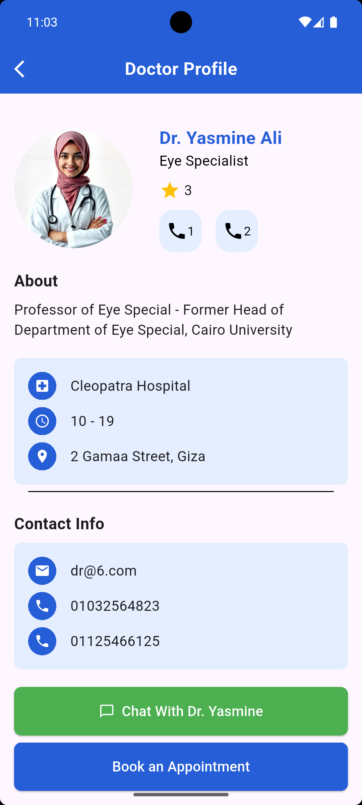

# Doctor_Appointment_Flutter_Mobile_App

This project is a Flutter-based mobile application designed to streamline the process of booking doctor appointments. It provides an intuitive and user-friendly interface for patients to browse available doctors, view their profiles, and schedule appointments efficiently. The app leverages Flutter's cross-platform capabilities to ensure a seamless experience on both Android and iOS devices. With a focus on simplicity and functionality.

# Demo_Preview

- 

# Table of contents
- [Project Title](#doctor_appointment_flutter_mobile_app)
- [Demo Preview](#demo-preview)
- [Table of contents](#table-of-contents)
- [Contribute](#contribute)
- [Installation](#installation)

# Contribute
Only Eraasoft reviewers are allowed to clone, fork, and pull my project.

# Installation
To use my project, first clone my repo on your device using the command below:
- ```git init```
- ```git clone https://github.com/Yasmine-Eraasoft/Doctor-Appointment-Flutter-Mobile-App.git```

Then run the app without debugging using your emulator.